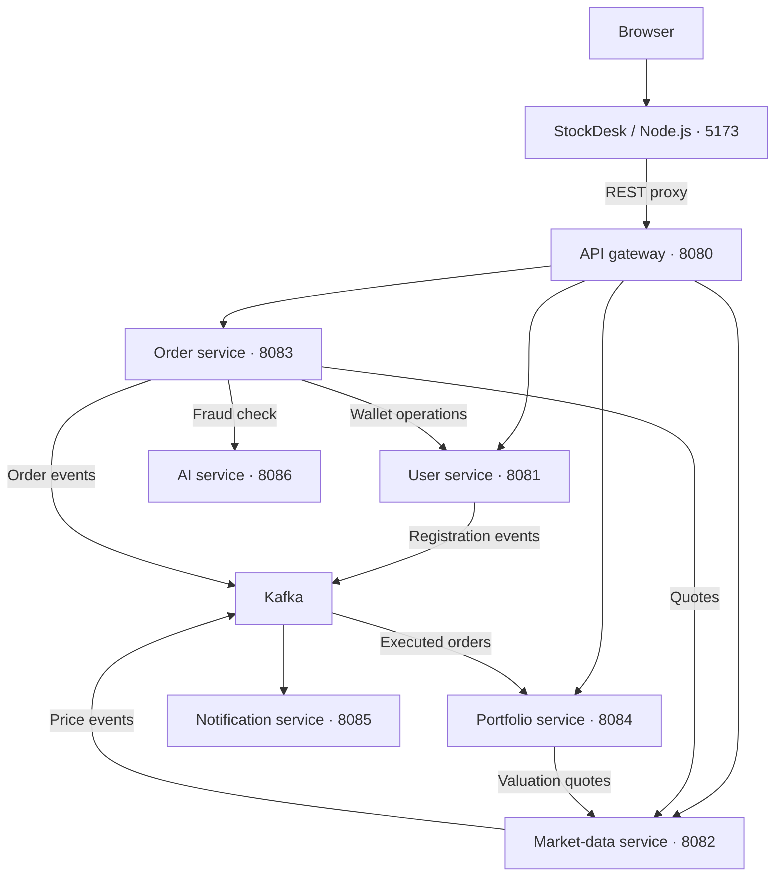

# 📈 Stock Trading Microservices Platform - Built using Java 25, Spring Boot 4.1.1, Apache Kafka, MySQL and AI.


A stock-trading simulation with six Spring Boot microservices, a Python service for AI-assisted fraud screening, and **StockDesk**, a responsive trading dashboard. The platform combines JWT authentication, wallet operations, simulated quotes, BUY/SELL orders, and Kafka-driven portfolio updates.

[Repository](https://github.com/swapdutt/stock-trading-platform) · [Frontend guide](frontend/README.md) · [Report an issue](https://github.com/swapdutt/stock-trading-platform/issues)

> **Project scope:** Prices and funds are simulated. No exchange, brokerage, payment provider, or live market-data feed is connected. The AI service calls Anthropic when configured; orders can proceed when AI checks fail. See [Current limitations](#current-limitations) for the implementation boundaries.

## Table of contents

- [Features](#features)
- [Architecture](#architecture)
- [Services and ports](#services-and-ports)
- [Technology stack](#technology-stack)
- [Repository layout](#repository-layout)
- [Quick start: frontend demo](#quick-start-frontend-demo)
- [Run the connected platform locally](#run-the-connected-platform-locally)
- [Configuration reference](#configuration-reference)
- [API reference](#api-reference)
- [Example trading workflow](#example-trading-workflow)
- [AI fraud screening](#ai-fraud-screening)
- [Kafka events](#kafka-events)
- [Market data and streaming](#market-data-and-streaming)
- [Testing and verification](#testing-and-verification)
- [Troubleshooting](#troubleshooting)
- [Current limitations](#current-limitations)
- [Contributing](#contributing)
- [License](#license)

## Features

| Area | Included functionality |
| --- | --- |
| StockDesk dashboard | Wallet and portfolio summaries, searchable markets, quote charts, BUY/SELL tickets, holdings, and order history |
| Demo mode | Practice funds and trades without starting the backend; data resets on page reload |
| Accounts | Registration, login, BCrypt password hashing, profile lookup, access tokens, and refresh-token generation |
| Wallet | Add funds; deduct funds for BUY orders; credit funds for SELL orders |
| Market data | Six built-in sample stocks, scheduled random price movements, Redis caching, and quote APIs |
| Orders | Quote-based execution, order history, ownership checks for individual order retrieval, and AI-flagged order details |
| AI screening | FastAPI endpoint that sends trade details to Claude and returns a suspicion flag, score, reason, and recommendation |
| Portfolio | Kafka-driven holdings, weighted average purchase price, invested capital, current value, and unrealized P&L |
| Notifications | Log messages for executed, failed, and AI-flagged orders; registration listener |
| Local infrastructure | Docker Compose for MySQL, Redis, and a single Kafka broker in KRaft mode |

## Architecture



The frontend serves static assets and forwards an allowlist of REST requests to the gateway. It forwards the bearer token and omits client-supplied `X-User-Id` headers. The gateway validates the JWT, extracts the `userId` claim, and replaces that header before routing protected requests.

Java services use direct configuration URLs rather than service discovery. Order and portfolio services use OpenFeign for HTTP calls. The AI service calls Anthropic externally; it is accessed directly by the order service and has no gateway route.

### Order processing

1. Fetch the current quote and calculate `price × quantity`.
2. Save the order with status `AI_CHECK`.
3. Send the order and its recent-order count to the AI service.
4. If `isSuspicious` is `true`, mark the order `FLAGGED`, publish `order.flagged`, and return without changing the wallet.
5. Otherwise, deduct the BUY amount or credit the SELL amount. Save `EXECUTED` and publish `order.executed`; execution exceptions lead to `FAILED` and `order.failed`.
6. The portfolio consumer applies executed orders asynchronously. The notification consumer logs the corresponding message.

| Order status | Meaning in the current implementation |
| --- | --- |
| `AI_CHECK` | Order saved before the synchronous screening call |
| `FLAGGED` | AI marked the order suspicious; execution was skipped |
| `EXECUTED` | Wallet operation completed and the order was saved as executed |
| `FAILED` | An exception occurred in the execution block |
| `PENDING` | Defined in the enum; the current placement flow starts at `AI_CHECK` |

An HTTP `201 Created` response can contain an `EXECUTED`, `FAILED`, or `FLAGGED` order. Always inspect `orderStatus` before treating a trade as successful.

## Services and ports

| Component | Port | Responsibility | Main dependencies |
| --- | --- | --- | --- |
| [`frontend`](frontend/) | `5173` | Dashboard, demo mode, REST proxy | Node.js; gateway in connected mode |
| [`api-gateway-service`](api-gateway-service/) | `8080` | REST routing, JWT validation, configured SockJS/WebSocket routes | Downstream HTTP services |
| [`user-service`](user-service/) | `8081` | Accounts, JWTs, wallet | MySQL, Kafka |
| [`market-data-service`](market-data-service/) | `8082` | Simulated quotes, Redis cache, price broadcasts | Redis, Kafka; configured MySQL datasource |
| [`order-service`](order-service/) | `8083` | Order execution, history, fraud-check integration | MySQL, Kafka, user/market/AI services |
| [`portfolio-service`](portfolio-service/) | `8084` | Holdings and valuation | MySQL, Kafka, market-data service |
| [`notification-service`](notification-service/) | `8085` | Event consumers and notification logs | Kafka |
| [`ai-service`](ai-service/) | `8086` | AI-assisted fraud assessment | Python dependencies; Anthropic credentials and connectivity |

Every Java service exposes `/actuator/health` and `/actuator/info` on its own port. The gateway does not forward these endpoints to downstream services.

### Infrastructure and storage

| Compose service | Image | Host endpoint | Container-network endpoint |
| --- | --- | --- | --- |
| `mysql` | `mysql:8.0` | `localhost:3306` | `mysql:3306` |
| `redis` | `redis:latest` | `localhost:6379` | `redis:6379` |
| `kafka` | `confluentinc/cp-kafka:7.4.0` | `localhost:9092` | `kafka:29092` |

| Storage | Usage |
| --- | --- |
| MySQL `user_db` | User accounts and wallet balances in `users` |
| MySQL `order_db` | Orders in `orders` |
| MySQL `portfolio_db` | Holdings in `holdings` |
| MySQL `market_data_db` | Datasource configured for market data; the current stock catalogue is held in memory |
| Redis | Quote keys such as `stock:price:TCS` |
| Market-data process memory | Built-in stock list and simulation state; reset when the service restarts |

JPA uses `ddl-auto: update`. Versioned database migrations are not included. Compose declares a persistent MySQL volume; Redis and Kafka have no dedicated persistence volumes.

## Technology stack

These versions are declared in the repository, rather than recommendations to upgrade to a particular release.

| Technology | Declared version / configuration |
| --- | --- |
| Java | `25` |
| Spring Boot | `4.1.1` |
| Maven wrapper | `3.9.16`, supplied inside each Java module |
| Spring Cloud BOM | `2025.1.3` in gateway, order, and portfolio modules |
| Gateway | `spring-cloud-starter-gateway-server-webflux` |
| Persistence / HTTP clients | Spring Data JPA, MySQL Connector/J `26.7.0`, OpenFeign |
| Authentication | JJWT `0.13.0`; Spring Security Crypto `7.1.1` |
| Messaging / caching | Spring Kafka; Spring Data Redis |
| Streaming | Spring WebSocket, STOMP, SockJS |
| Frontend | HTML, CSS, JavaScript modules; Node.js `18+`; no npm dependencies |
| Python API | FastAPI `0.104.1`, Uvicorn `0.24.0`, Pydantic `2.4.2` |
| AI client | Anthropic Python SDK `0.18.1`; model string `claude-sonnet-4-6` in `main.py` |

The parent POM overrides multiple library versions, including both Jackson 2 and Jackson 3 dependencies. Consult the resolved Maven dependency tree when diagnosing compatibility problems. A successful Java build has not been established by this documentation review.

## Repository layout

| Path | Contents |
| --- | --- |
| [`pom.xml`](pom.xml) | Parent Maven reactor, six Java modules, shared dependency versions |
| [`docker-compose.yml`](docker-compose.yml) | Infrastructure containers, health checks, MySQL volume, bridge network |
| `api-gateway-service/` | Reactive gateway application, route configuration, JWT filter |
| `user-service/` | Account/wallet APIs, DTOs, persistence, token generation |
| `market-data-service/` | Built-in quotes, scheduled simulation, Redis and STOMP configuration |
| `order-service/` | Order API, persistence, Feign clients, Kafka publication |
| `portfolio-service/` | Holding persistence, order-event consumer, portfolio valuation |
| `notification-service/` | Registration and order-event listeners |
| [`ai-service/main.py`](ai-service/main.py) | FastAPI application and Anthropic integration |
| [`ai-service/requirements.txt`](ai-service/requirements.txt) | Pinned Python dependencies |
| [`frontend/server.mjs`](frontend/server.mjs) | Static server and restricted REST proxy |
| `frontend/public/` | Dashboard, styles, API client, demo account, trading helpers |
| `frontend/tests/` | Node.js tests for API/proxy contracts and trading helpers |
| Each Java module's `src/main/resources/application.yaml` | Service port, infrastructure connections, local settings |
| Each Java module's `src/test/java/` | Spring Boot application-context test |

The frontend and AI service run independently of Maven. Docker Compose provisions infrastructure only; it does not launch the application services.

## Quick start: frontend demo

Install Node.js 18 or newer, then run:

```bash
git clone https://github.com/swapdutt/stock-trading-platform.git
cd stock-trading-platform/frontend
npm start
```

Open **[http://localhost:5173](http://localhost:5173)**. No `npm install`, Java service, database, or AI account is needed for demo mode.

The dashboard opens with sample holdings, orders, quotes, and a practice wallet. Try adding funds, buying/selling shares, searching stocks, and viewing order details. Demo data is held in memory and resets on reload. Demo AI flags are illustrative and do not call the AI service.

## Run the connected platform locally

### 1. Prerequisites

| Requirement | Purpose |
| --- | --- |
| JDK `25` | Compile and run the Java services; check the JDK reported by Maven |
| Maven or module wrapper | Build the reactor; wrappers request Maven `3.9.16` |
| Docker with Compose | Start the bundled MySQL, Redis, and Kafka infrastructure |
| Node.js `18+` | Run StockDesk |
| Python | Run the AI service and the response-parsing examples; the repository does not pin an interpreter version |
| Git and cURL | Clone the project and exercise APIs |
| Network access | Resolve Maven/Python dependencies; reach Anthropic for provider-backed checks |

Reserve ports `3306`, `6379`, `9092`, `5173`, and `8080`–`8086`. The remaining setup commands assume the **repository root**, unless another directory is shown.

### 2. Start infrastructure

```bash
docker compose up -d mysql redis kafka
docker compose ps
docker compose logs --tail=100 mysql redis kafka
```

Wait for the infrastructure health checks to pass. The committed MySQL root password is `root`; Java datasource passwords are blank in YAML, so supply the environment override below.

### 3. Prepare databases and Java configuration

Open MySQL and enter `root` at the password prompt:

```bash
docker compose exec mysql mysql -u root -p
```

```sql
CREATE DATABASE IF NOT EXISTS user_db;
CREATE DATABASE IF NOT EXISTS order_db;
CREATE DATABASE IF NOT EXISTS portfolio_db;
CREATE DATABASE IF NOT EXISTS market_data_db;
```

The JDBC URLs also specify `createDatabaseIfNotExist=true`. No stock seeding is required: the market-data service already defines its sample stocks in Java.

For Bash, configure the service terminals or your IDE run configurations with:

```bash
export SPRING_DATASOURCE_USERNAME=root
export SPRING_DATASOURCE_PASSWORD=root
export SPRING_KAFKA_BOOTSTRAP_SERVERS=localhost:9092
export JWT_SECRET="$(python3 -c 'import base64,secrets; print(base64.b64encode(secrets.token_bytes(32)).decode())')"
```

Generate `JWT_SECRET` **once** and supply that same value to user service and gateway. Apply the appropriate variables in every service terminal; separately opened terminals do not inherit another terminal's exports. The checked-in YAML contains a shared development signing key, which this override replaces.

Set `SPRING_KAFKA_BOOTSTRAP_SERVERS` for notification service as well: its YAML currently uses the singular `bootstrap-server` property instead of `bootstrap-servers`.

<details>
<summary>Optional: create Kafka topics explicitly</summary>

The broker enables automatic topic creation. These commands also verify connectivity:

```bash
for topic in user.register order.executed order.failed order.flagged stock.price.updated; do
  docker compose exec -T kafka kafka-topics --bootstrap-server kafka:29092 \
    --create --if-not-exists --topic "$topic" \
    --partitions 1 --replication-factor 1
done
```

Replication factor `1` matches the single broker in the Compose file.

</details>

### 4. Build the Java services

```bash
java -version
mvn -version
mvn --batch-mode -DskipTests clean package
```

If Maven is not installed, use a module wrapper from the root:

```bash
bash user-service/mvnw --batch-mode -f pom.xml -DskipTests clean package
```

Windows wrapper equivalent:

```powershell
.\user-service\mvnw.cmd --batch-mode -f pom.xml -DskipTests clean package
```

There is no root-level `mvnw`. The initial package command skips the application-context tests; run them separately after configuring infrastructure. If dependency resolution fails, check the committed version coordinates and Maven repository access before attempting to launch services.

### 5. Start the AI service

For provider-backed screening, first follow [AI credential configuration](#ai-credential-configuration). Then create an isolated Python environment:

```bash
cd ai-service
python3 -m venv .venv
source .venv/bin/activate
python -m pip install -r requirements.txt
python main.py
```

On Windows, activate with `.venv\Scripts\Activate.ps1` instead of `source`. Alternatively, from `ai-service/`, run `python -m uvicorn main:app --host 127.0.0.1 --port 8086` after activating the environment.

Check **[http://localhost:8086/health](http://localhost:8086/health)** and the interactive API at **[http://localhost:8086/docs](http://localhost:8086/docs)**. Provider connectivity must be checked separately; `/health` does not call Anthropic.

The order service can run without the AI service, but a failed AI call allows execution to continue. That behavior does not demonstrate successful fraud screening.

### 6. Start the Java applications

Run each command in a separate terminal from the root, with the configuration from step 3. Start user and market services before placing orders; start portfolio and notification consumers before the smoke test.

| Application | Command |
| --- | --- |
| User | `mvn -pl user-service spring-boot:run` |
| Market data | `mvn -pl market-data-service spring-boot:run` |
| Portfolio | `mvn -pl portfolio-service spring-boot:run` |
| Notifications | `mvn -pl notification-service spring-boot:run` |
| Orders | `mvn -pl order-service spring-boot:run` |
| Gateway | `mvn -pl api-gateway-service spring-boot:run` |

For wrapper execution, replace `mvn` with `bash user-service/mvnw -f pom.xml`. Packaged services can also run as JARs, for example:

```bash
java -jar user-service/target/user-service-1.0.0.jar
```

### 7. Connect StockDesk

```bash
cd frontend
npm start
```

Open [http://localhost:5173](http://localhost:5173), click **Connect backend**, and register or sign in. The browser communicates with the local frontend server, which forwards requests to `http://localhost:8080`; browser CORS changes are not required for this workflow.

Connected mode refreshes account, quotes, orders, and portfolio data every five seconds. You can also refresh manually or pause updates. Access tokens remain in memory, so reloading requires signing in again. Charts show quotes observed during the browser session.

### 8. Stop the applications

Use `Ctrl+C` in each application terminal, then stop infrastructure:

```bash
docker compose down
```

This preserves the named MySQL volume. Avoid `docker compose down -v` unless you intend to delete the stored local data.

## Configuration reference

| Environment variable | Default / value | Applies to |
| --- | --- | --- |
| `JWT_SECRET` | Same Base64-encoded HMAC secret in both applications | User, gateway |
| `SPRING_DATASOURCE_USERNAME` | `root` | User, market data, order, portfolio |
| `SPRING_DATASOURCE_PASSWORD` | `root` for bundled Compose; blank in Java YAML | User, market data, order, portfolio |
| `SPRING_DATASOURCE_URL` | JDBC URL for each service's database | Each datasource independently |
| `SPRING_KAFKA_BOOTSTRAP_SERVERS` | `localhost:9092` | All Kafka producers and consumers |
| `SPRING_DATA_REDIS_HOST` / `SPRING_DATA_REDIS_PORT` | `localhost` / `6379` | Market data |
| `USER_SERVICE_URL` | `http://localhost:8081` | Order |
| `MARKET_SERVICE_URL` | `http://localhost:8082` | Order, portfolio |
| `AI_SERVICE_URL` | `http://localhost:8086` | Order |
| `GATEWAY_URL` | `http://localhost:8080`; HTTP(S) origin without an added path | Frontend server |
| `HOST` / `PORT` | `127.0.0.1` / `5173` | Frontend server |
| `ANTHROPIC_API_KEY` | Requires the initialization change documented below | AI service |

Additional YAML settings:

- `market.price-update-interval: 2000` sets the simulation interval in milliseconds.
- `jwt.expiration: 86400000` means **24 hours** for access tokens.
- `jwt.refreshTokenExpiration: 604800000` means **7 days** for refresh tokens. The adjacent YAML comments are inaccurate; no refresh exchange endpoint is implemented.
- Gateway destination URLs are literal route configuration values. Change those routes separately when moving services off `localhost`.

For a different frontend/gateway address in Bash:

```bash
GATEWAY_URL=http://127.0.0.1:8080 PORT=5173 npm --prefix frontend start
```

PowerShell equivalent:

```powershell
$env:GATEWAY_URL = "http://127.0.0.1:8080"
$env:PORT = "5173"
npm --prefix frontend start
```

The frontend does not automatically load `.env` files. If applications are containerized later, use container-network hostnames rather than assuming their `localhost` addresses refer to the host machine.

## API reference

**Gateway base URL:** `http://localhost:8080`

Except for registration and login, the REST routes below require `Authorization: Bearer <accessToken>` at the gateway. Clients should use the access token returned by authentication; the gateway supplies `X-User-Id`.

### Accounts and wallet

| Method | Path | Input / purpose |
| --- | --- | --- |
| `POST` | `/api/v1/users/register` | Public; `firstName`, `lastName`, `email`, `password`, optional `initialDeposit` |
| `POST` | `/api/v1/users/login` | Public; `email`, `password` |
| `GET` | `/api/v1/users/userDetail` | Current authenticated user's profile and wallet |
| `GET` | `/api/v1/users/{userId}` | Profile by ID |
| `POST` | `/api/v1/users/{userId}/funds/add?amount=5000.00` | Add funds |
| `POST` | `/api/v1/users/{userId}/funds/deduct?amount=100.00` | Deduct funds; used by order service |
| `POST` | `/api/v1/users/{userId}/funds/credit?amount=100.00` | Credit funds; used by order service |

Registration defaults to a simulated deposit of `10000`. Names and credentials are required, email must be valid, and passwords must have at least six characters. Authentication responses include `accessToken`, `refreshToken`, `tokenType`, `userId`, identity fields, and `walletBalance`.

### Market, orders, and portfolio

| Method | Path | Purpose |
| --- | --- | --- |
| `GET` | `/api/v1/market/stocks` | All current sample quotes |
| `GET` | `/api/v1/market/stocks/{symbol}` | Quote for a symbol; lookup normalizes to uppercase |
| `POST` | `/api/v1/orders/` | Submit `symbol`, `orderType` (`BUY` or `SELL`), and integer `quantity` |
| `GET` | `/api/v1/orders/current-order-list` | Current user's orders, newest first |
| `GET` | `/api/v1/orders/{orderId}` | Individual order; returns `403` for a different owner |
| `GET` | `/api/v1/portfolio/current-portfolio` | Current user's holdings and valuation |
| `GET` | `/api/v1/portfolio/{userId}` | Portfolio by ID; intended for internal lookup |

Preserve the **trailing slash** on `POST /api/v1/orders/` and the case of `userDetail`. The controller replaces any supplied order `userId` with the gateway-derived identity.

Portfolio responses contain `userId`, `holdings`, `totalInvested`, `currentValue`, `totalPnl`, `totalPnlPercent`, and `isProfit`. Holding items include `symbol`, `quantity`, `averageBuyPrice`, `currentPrice`, `currentValue`, `invested`, `pnlPercent`, and `isProfit`.

The gateway protects broad user and portfolio paths, but those controllers do not consistently check ownership for path IDs. The frontend proxy exposes only its required routes and does not expose wallet deduction/credit or arbitrary portfolio lookup.

### AI and operational endpoints

| Base URL | Method | Path | Purpose |
| --- | --- | --- | --- |
| `http://localhost:8086` | `GET` | `/health` | AI process health; no provider check |
| `http://localhost:8086` | `POST` | `/api/fraud/check` | Fraud assessment; schema below |
| `http://localhost:8086` | `GET` | `/docs` | FastAPI interactive documentation |
| Each Java service | `GET` | `/actuator/health` | Service health |
| Each Java service | `GET` | `/actuator/info` | Exposed info endpoint; additional info is not configured |

The AI endpoints have no authentication middleware in the current implementation. No notification REST API is defined. Java Swagger/OpenAPI documentation and a Postman collection are not included.

### Error responses

Custom Java exception handlers return `guid`, `errorCode`, `errorMessage`, `statusCode`, `statusName`, and `timestamp`. Framework validation errors may use a different structure. Gateway JWT failures return **`401` with an empty body**; their explanatory message is logged.

Some business failures are represented inside a returned order. For example, an insufficient-balance error during execution can produce HTTP `201` with `orderStatus: FAILED` and a `failureReason`.

## Example trading workflow

The examples use Bash, cURL, and Python for JSON parsing. Start the connected services first.

### Register and capture the access token

```bash
export API_BASE=http://localhost:8080

AUTH_RESPONSE=$(curl --fail-with-body --silent --show-error \
  -X POST "$API_BASE/api/v1/users/register" \
  -H 'Content-Type: application/json' \
  --data '{"firstName":"Demo","lastName":"Trader","email":"demo.trader@example.com","password":"LocalDemo123!","initialDeposit":10000}')

export ACCESS_TOKEN=$(printf '%s' "$AUTH_RESPONSE" | python3 -c 'import json,sys; print(json.load(sys.stdin)["accessToken"])')
export USER_ID=$(printf '%s' "$AUTH_RESPONSE" | python3 -c 'import json,sys; print(json.load(sys.stdin)["userId"])')
```

If the account already exists, obtain a fresh authentication response with login and repeat the two export commands above:

```bash
AUTH_RESPONSE=$(curl --fail-with-body --silent --show-error \
  -X POST "$API_BASE/api/v1/users/login" \
  -H 'Content-Type: application/json' \
  --data '{"email":"demo.trader@example.com","password":"LocalDemo123!"}')
```

### Read the profile, add funds, and inspect a quote

```bash
curl --fail-with-body "$API_BASE/api/v1/users/userDetail" \
  -H "Authorization: Bearer $ACCESS_TOKEN"

curl --fail-with-body -X POST \
  "$API_BASE/api/v1/users/$USER_ID/funds/add?amount=5000.00" \
  -H "Authorization: Bearer $ACCESS_TOKEN"

curl --fail-with-body "$API_BASE/api/v1/market/stocks/TCS" \
  -H "Authorization: Bearer $ACCESS_TOKEN"
```

### Buy one share and inspect the result

```bash
BUY_RESPONSE=$(curl --fail-with-body --silent --show-error \
  -X POST "$API_BASE/api/v1/orders/" \
  -H "Authorization: Bearer $ACCESS_TOKEN" \
  -H 'Content-Type: application/json' \
  --data '{"symbol":"TCS","orderType":"BUY","quantity":1}')

printf '%s' "$BUY_RESPONSE" | python3 -m json.tool
ORDER_ID=$(printf '%s' "$BUY_RESPONSE" | python3 -c 'import json,sys; print(json.load(sys.stdin)["id"])')

curl --fail-with-body "$API_BASE/api/v1/orders/$ORDER_ID" \
  -H "Authorization: Bearer $ACCESS_TOKEN"

curl --fail-with-body "$API_BASE/api/v1/orders/current-order-list" \
  -H "Authorization: Bearer $ACCESS_TOKEN"

curl --fail-with-body "$API_BASE/api/v1/portfolio/current-portfolio" \
  -H "Authorization: Bearer $ACCESS_TOKEN"
```

Confirm `orderStatus` is `EXECUTED`, then repeat the portfolio read until Kafka processing makes the holding visible. Check the profile again to see the wallet debit.

After confirming that you hold the share, sell it:

```bash
curl --fail-with-body -X POST "$API_BASE/api/v1/orders/" \
  -H "Authorization: Bearer $ACCESS_TOKEN" \
  -H 'Content-Type: application/json' \
  --data '{"symbol":"TCS","orderType":"SELL","quantity":1}'
```

Use positive amounts and valid owned quantities. If a trade or deposit times out, refresh orders and the wallet before retrying; writes are not idempotent in the current backend.

## AI fraud screening

The current [`main.py`](ai-service/main.py) sends order details to Anthropic using the configured model string `claude-sonnet-4-6`. It asks the model to assess frequency, order amount, quantity patterns, and other suspicious signals, then parses a JSON response.

The older rule thresholds described in [`ai-service/README.md`](ai-service/README.md) do **not** match the current Python implementation. There is no implemented fixed score threshold such as `fraudScore > 0.5`.

### AI credential configuration

The checked-in client initialization uses a placeholder API-key string. Merely exporting `ANTHROPIC_API_KEY` will not override that argument. To read credentials from the environment, replace the client initialization in `ai-service/main.py` with:

```python
import os

client = anthropic.Anthropic(
    api_key=os.environ["ANTHROPIC_API_KEY"]
)
```

Provide the key through the AI process environment or your IDE. For Bash, this reads it without displaying it:

```bash
read -r -s -p 'Anthropic API key: ' ANTHROPIC_API_KEY
printf '\n'
export ANTHROPIC_API_KEY
```

Then start the service as described in local setup. Model access and SDK compatibility must be verified with a real fraud-check request. Missing credentials after the initialization change cause startup to fail rather than silently use a placeholder.

### Fraud-check contract

`POST http://localhost:8086/api/fraud/check`

| Request field | Type | Meaning |
| --- | --- | --- |
| `orderId` | String | Saved order ID |
| `userId` | String | Trader ID |
| `symbol` | String | Stock symbol |
| `type` | String | `BUY` or `SELL` from order service |
| `quantity` | Integer | Share quantity |
| `price` | Number | Quote used for the order |
| `totalAmount` | Number | Price multiplied by quantity |
| `recentOrderCount` | Integer, optional | Default `0`; order service counts the user's orders created within the preceding hour, including the newly saved order |

Responses contain `orderId`, `isSuspicious`, `fraudScore`, `reason`, `recommendation`, `aiProvider`, and `checkedAt`.

The Java integration blocks only when `isSuspicious` is `true`. It logs the score but does not apply a score threshold or act on `recommendation` independently. The order persists `flaggedByAI` and `aiReason`; it does not persist the returned score or recommendation.

### Failure behavior

- Invalid provider JSON or provider-call errors produce a Python response with `isSuspicious: false`, score `0.0`, and recommendation `ALLOW`.
- A transport/client exception in Java is caught, and order execution continues without a completed check.
- `/health` reports process health even if the key is invalid or the provider is unavailable.

An executed order alone therefore does not prove AI screening succeeded. Check AI logs and `aiProvider` on direct fraud-check responses. Trade details, including order/user IDs, quantities, and amounts, are sent to the external provider when configured.

## Kafka events

| Topic | Producer | Message key | Consumers |
| --- | --- | --- | --- |
| `user.register` | User service | User ID | Notification service |
| `order.executed` | Order service | Order ID | Portfolio and notification services |
| `order.failed` | Order service | Order ID | Notification service |
| `order.flagged` | Order service | Order ID | Notification service |
| `stock.price.updated` | Market-data service | Stock symbol | No listener implemented in this repository |

The registration topic is **`user.register`**, as declared by both producer and listener. Order events contain `orderId`, `userId`, `symbol`, `type`, `status`, `quantity`, `price`, and `totalAmount`, plus `reason` for failed or flagged events. Price events contain `symbol`, `price`, and `timestamp`.

Portfolio and notifications use separate consumer groups, `portfolio-service-group` and `notification-service-group`, so both can receive executed-order events. Their configuration starts at the earliest available offset when no committed offset exists.

Inspect executed events locally:

```bash
docker compose exec kafka kafka-console-consumer \
  --bootstrap-server kafka:29092 \
  --topic order.executed --from-beginning
```

Portfolio visibility is eventually consistent. Publication and database changes do not share a distributed transaction, and consumers do not deduplicate repeated events.

## Market data and streaming

The market-data service defines `RELIANCE`, `TCS`, `INFY`, `AAPL`, `GOOGL`, and `MSFT` in memory. It changes prices every two seconds by approximately ±0.25% per update, enforces a minimum price of `1`, updates Redis, broadcasts a quote, and publishes a price event.

StockDesk displays all amounts as INR, including the simulated US-stock examples. No currency conversion, historical market feed, or exchange session calendar is implemented.

### STOMP / SockJS interface

| Setting | Current value |
| --- | --- |
| Direct SockJS endpoint | `http://localhost:8082/ws` |
| Configured gateway SockJS path | `http://localhost:8080/ws` |
| Broker destination prefix | `/topic` |
| Application destination prefix | `/app` |
| TCS subscription destination | `/topic/pricesTCS` |
| RELIANCE subscription destination | `/topic/pricesRELIANCE` |

There is **no slash between `prices` and the symbol** in the current broadcast destination. The gateway declares separate upgrade and SockJS routes, both with an HTTP upstream; actual WebSocket upgrade behavior needs integration verification. If upgrades fail, review the WebFlux WebSocket route and its `ws://` upstream separately from the HTTP SockJS fallback.

The current `/ws` routes have no JWT filter, and the market endpoint allows all origin patterns. StockDesk uses REST polling and does not use this streaming interface or proxy `/ws` requests.

## Testing and verification

### Frontend checks

```bash
cd frontend
npm run check
npm test
```

The repository includes six Node.js tests covering exact REST paths and payloads, JWT forwarding, restricted proxy routes, gateway failure handling without replay, amount/quantity validation, demo wallet/holding updates, and HTML escaping. Syntax checks and all six tests passed during this README review.

### Java checks

With JDK 25 and local infrastructure configured:

```bash
mvn --batch-mode test
mvn --batch-mode verify
```

Each Java module currently has a Spring Boot `contextLoads()` test. Business-flow, contract, and end-to-end coverage is not yet present in the Java test suite.

### Connected smoke test

1. Check Java health endpoints and AI process health.
2. Register, sign in, and read the wallet and sample quotes.
3. Add funds and buy one share; inspect `orderStatus` and the wallet debit.
4. Wait for the holding to appear, then sell only the quantity held.
5. Inspect order history, portfolio updates, Kafka events, and notification logs.
6. Separately verify a provider-backed fraud-check response and gateway streaming if needed.

Java builds, live AI calls, and the connected stack were not run during this documentation review. Frontend tests use a mock gateway and do not validate the running Java services.

## Troubleshooting

| Symptom | Checks / action |
| --- | --- |
| MySQL access denied | Supply `SPRING_DATASOURCE_PASSWORD=root` for bundled Compose, or match your existing server's credentials |
| Missing root `mvnw` | Use installed Maven or `bash user-service/mvnw -f pom.xml` from the repository root |
| Compilation or dependency resolution fails | Verify Maven uses JDK 25, repository access works, and all pinned POM coordinates resolve; inspect dependency management before changing versions |
| Gateway returns `401` | Use the access token, confirm user/gateway secrets match, and check expiry; an empty response body is current behavior |
| Order submission returns `404` | Preserve `/api/v1/orders/`, including its trailing slash; confirm the gateway and order service are running |
| Frontend reports `502` | Confirm `GATEWAY_URL` and port `8080`; check orders/wallet before retrying a write |
| Portfolio is stale | Verify Kafka and portfolio service, `order.executed`, consumer logs, and group offsets; HTTP order success does not guarantee consumer completion |
| Notification consumer cannot find Kafka | Override with `SPRING_KAFKA_BOOTSTRAP_SERVERS`; correct the singular YAML property if editing configuration |
| Registration welcome message is missing | The welcome listener's `String.format` currently has three placeholders but two arguments; its exception is logged |
| AI reports `UP` but never flags trades | Check credential initialization, provider/SDK errors, and fallback responses; health does not prove screening worked |
| SockJS works but WebSocket upgrades fail | Verify the upgrade route and WebFlux WebSocket URI handling; keep HTTP fallback routing separate |
| Port/container conflict | Compose fixes names `mysql`, `redis`, and `kafka`; adjust ports/names and application connections together |

## Current limitations

These boundaries are visible in the current source and should guide further implementation:

- **Authorization:** Direct backend ports trust downstream identity headers. User/profile/wallet routes by ID and portfolio lookup by ID lack consistent ownership checks. Restrict access to service ports and add service-level authorization before wider deployment.
- **Wallet validation and concurrency:** Amounts and initial deposits lack positive-value constraints. Wallet read/modify/write operations have no locking/version control or idempotency keys. `quantity` has `@Min(1)` but lacks `@NotNull`.
- **SELL correctness:** The order service credits the wallet before the portfolio consumer checks available shares. Consumer rejection does not reverse the credit. StockDesk prevents obvious overselling in its UI, but backend enforcement is still required.
- **Consistency and recovery:** Wallet calls, order persistence, and Kafka publication are not atomic. Send results are not awaited, consumers lack event deduplication, and processing exceptions are caught and logged. Add reliable publication, retries, and compensation.
- **AI reliability:** Provider output is parsed from free-form JSON without a decision-policy validator. Both Python and Java allow execution on screening errors; flagged orders have no manual-review or release API.
- **Account lifecycle:** Access and refresh tokens share the signing approach and lack a token-purpose distinction checked by the gateway. Refresh exchange, revocation, and server-side logout are absent; account status is not enforced at login.
- **Portfolio completeness:** A quote-fetching failure omits that holding from the response and its calculated totals. Realized P&L and a transaction ledger are not implemented.
- **Notifications:** Delivery is log-based; email, SMS, and push integrations are absent. The registration welcome-message formatting error still needs correction.
- **Deployment:** No application Dockerfiles, deployment manifests, database migrations, or CI/CD workflows are committed. Kafka is a single local broker, Redis uses `latest`, and only MySQL has a declared persistent volume.
- **Trading scope:** No limit orders, partial fills, matching engine, brokerage settlement, exchange feed, or real payment flow is implemented.

## Contributing

Open an [issue](https://github.com/swapdutt/stock-trading-platform/issues) with the affected service, reproduction steps, and relevant logs. Keep changes focused, verify the behavior affected, and update documentation when API paths, configuration, events, or startup requirements change.

Maintainer: [swapdutt](https://github.com/swapdutt).

## License

No `LICENSE` file is included in the reviewed repository. Licensing terms should be defined by the repository maintainer.

---