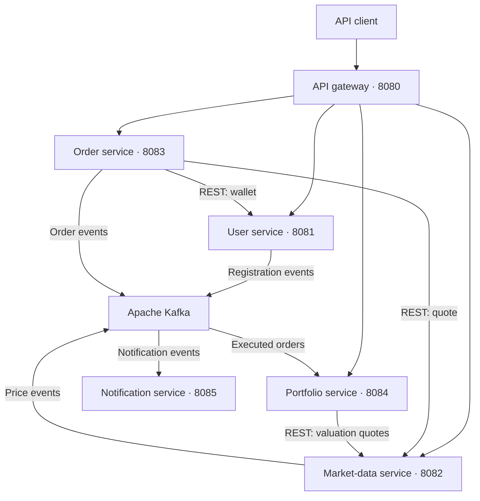

# 📈 Stock Trading Microservices Platform - Built using Java 25, Spring Boot 4.1.1, Apache Kafka, MySQL and AI.


A backend stock-trading simulation built around six Java microservices. The platform provides trader accounts, simulated market prices, BUY/SELL order processing, wallet operations, portfolio valuation, and Kafka-driven notification handling. A committed Docker Compose file provisions MySQL, Redis, and Kafka for local development.

[Repository](https://github.com/swapdutt/stock-trading-platform) · [Report an issue](https://github.com/swapdutt/stock-trading-platform/issues)

> **Development status:** The repository contains the core service implementations, with build, configuration, and integration fixes still required. Read [Known issues and limitations](#known-issues-and-limitations) before starting the application. Prices are simulated; the repository contains no live exchange or brokerage integration. The AI service and email/SMS delivery remain unfinished.

## Table of contents

- [Overview](#overview)
- [Features](#features)
- [Architecture](#architecture)
- [Services and ports](#services-and-ports)
- [Technology stack](#technology-stack)
- [Repository structure](#repository-structure)
- [Local setup](#local-setup)
- [API reference](#api-reference)
- [Example API workflow](#example-api-workflow)
- [Kafka events](#kafka-events)
- [Market-price streaming](#market-price-streaming)
- [Testing and verification](#testing-and-verification)
- [Known issues and limitations](#known-issues-and-limitations)
- [Development priorities](#development-priorities)
- [Contributing](#contributing)
- [License](#license)

## Overview

The project demonstrates a trading backend that combines synchronous REST calls with asynchronous events:

1. A trader registers or logs in through the user service.
2. The market-data service loads active stocks from MySQL and simulates price changes every two seconds.
3. The order service obtains a quote and deducts or credits the trader's wallet through the user service.
4. An executed order is published to Kafka.
5. The portfolio service consumes the event to update holdings, while the notification service writes notification messages to its logs.

The Java services form a Maven multi-module project. Each service is a separate Spring Boot application with its own port. Docker Compose starts the three infrastructure containers; the Java services run separately through Maven, an IDE, or packaged JARs. The repository currently provides backend APIs; a frontend application is not included.

## Features

The following capabilities are present in source code. Their availability depends on resolving the issues documented below.

| Area | Implemented behavior | Current boundary |
| --- | --- | --- |
| Trader accounts | Registration, email/password login, profile lookup, BCrypt password hashing | Account-status enforcement and a token-refresh endpoint are absent |
| Authentication | Access-token and refresh-token generation; gateway JWT verification filter | Gateway configuration and user-ID forwarding require fixes |
| Wallet | Add, deduct, and credit funds using `BigDecimal` | Positive-amount validation and concurrency controls need work |
| Market data | Active-stock catalogue, current quotes, simulated price updates, Redis caching | Stock seeding is manual; no external market-data feed is connected |
| Orders | Immediate BUY/SELL processing at the current quote; `PENDING`, `EXECUTED`, and `FAILED` states; order history | Limit orders, partial fills, and an exchange matching engine are absent |
| Portfolio | Holdings, weighted average purchase price, invested value, current value, and unrealized P&L | Updates arrive asynchronously through Kafka |
| Notifications | Consumers for executed/failed orders and a registration listener; log-based messages | Registration topic mismatch; email/SMS delivery is pending |
| Streaming | STOMP messaging with a SockJS endpoint and per-symbol price broadcasts | No bundled browser client |
| Operations | Actuator `health` and `info` endpoint exposure; Docker Compose for MySQL, Redis, and Kafka | Java-service container images and a CI/CD workflow are not included |
| AI | An `ai-service` directory exists | `main.py` is empty; fraud screening is mentioned in order-service comments but is not implemented |

## Architecture



The diagram shows the service connections declared in code. The gateway is intended to authenticate protected requests and supply `X-User-Id` to downstream controllers. Its current filter does not populate that header correctly.

The market-data service also writes quotes to Redis and broadcasts price updates to STOMP subscribers. Order and portfolio services use OpenFeign for their HTTP calls. Service URLs are configured directly as `localhost` addresses; no service-discovery component is included.

### Data storage

The checked-in configuration uses two shared MySQL schemas:

| Store | Services | Data |
| --- | --- | --- |
| MySQL `user_db` | User, market data | `users`, `stocks` |
| MySQL `order_db` | Order, portfolio | `orders`, `holdings` |
| Redis | Market data | Quote keys such as `stock:price:TCS` |
| In-memory map | Market data | Running simulation state loaded from active stocks at startup |

These are the actual configuration defaults. Separate databases per service would require configuration changes. JPA services use `spring.jpa.hibernate.ddl-auto=update`; versioned database migrations are not supplied.

Docker Compose declares the `mysql-data` volume for MySQL storage and a `trading-network` bridge network for infrastructure communication. It declares no dedicated volumes for Redis or Kafka.

## Services and ports

| Module | Port | Responsibility | Dependencies |
| --- | --- | --- | --- |
| [`api-gateway-service`](api-gateway-service/) | `8080` | Route APIs and apply JWT filtering | User, market-data, order, and portfolio HTTP endpoints |
| [`user-service`](user-service/) | `8081` | Accounts, token generation, profiles, and wallet balances | MySQL, Kafka |
| [`market-data-service`](market-data-service/) | `8082` | Stock catalogue, quote simulation, caching, and streaming | MySQL, Redis, Kafka |
| [`order-service`](order-service/) | `8083` | Order processing and order history | MySQL, Kafka, user service, market-data service |
| [`portfolio-service`](portfolio-service/) | `8084` | Event-driven holdings and portfolio valuation | MySQL, Kafka, market-data service |
| [`notification-service`](notification-service/) | `8085` | Consume events and log notification messages | Kafka |

[`ai-service`](ai-service/) is outside the Maven reactor and has no runnable implementation or configured port.

### Infrastructure containers

The following services are defined in [`docker-compose.yml`](docker-compose.yml):

| Compose service | Image | Host endpoint | Container-network endpoint |
| --- | --- | --- | --- |
| `mysql` | `mysql:8.0` | `localhost:3306` | `mysql:3306` |
| `redis` | `redis:latest` | `localhost:6379` | `redis:6379` |
| `kafka` | `confluentinc/cp-kafka:7.4.0` | `localhost:9092` | `kafka:29092` |

Kafka runs in KRaft mode with combined broker/controller roles and a single node. Its controller listener uses `kafka:9093` internally and is not published to the host. No ZooKeeper service is defined.

The host endpoints match the Java applications' current `localhost` settings. Applications added to the Compose network would need the container-network endpoints instead.

## Technology stack

Versions below are taken from the committed POMs and Maven wrapper settings. They describe the repository's declared dependencies; a passing dependency-resolution or compatibility check is not implied.

| Technology | Declared version or configuration | Purpose |
| --- | --- | --- |
| Java | `25` | Java-service compilation target |
| Spring Boot | `4.1.1` | Application framework |
| Maven wrapper distribution | `3.9.16` | Build tooling |
| Spring Cloud BOM | `2025.1.3` in gateway, order, and portfolio modules | Spring Cloud dependency management |
| Spring Cloud Gateway | `4.3.5` | API routing and JWT filter integration |
| Spring Data JPA / Hibernate | Managed through Spring Boot | Relational persistence |
| MySQL server | Compose image `mysql:8.0` | Relational database server |
| MySQL Connector/J | `26.7.0` | JDBC driver in user, order, and portfolio modules |
| Apache Kafka | Compose image `confluentinc/cp-kafka:7.4.0`; root POM separately pins `kafka_2.13` to `4.3.1` | Event transport |
| Redis / Spring Data Redis | Compose image `redis:latest`; Spring dependencies managed through Boot | Quote caching |
| Docker Compose | Committed `docker-compose.yml`; engine/CLI versions are not pinned | Local infrastructure provisioning |
| OpenFeign | Managed through the Spring Cloud BOM | Service-to-service HTTP calls |
| JJWT | `0.13.0` | JWT signing and verification APIs |
| Spring Security Crypto | `7.1.1` | BCrypt password hashing |
| Lombok | `1.18.48` | Generated constructors, accessors, and builders |
| Jackson | Root POM pins Jackson core/databind to `3.2.3` | JSON processing |
| Spring WebSocket / STOMP / SockJS | Managed through Spring Boot | Price broadcasts |

## Repository structure

| Path | Contents |
| --- | --- |
| [`pom.xml`](pom.xml) | Parent POM, six Java modules, shared properties, and dependencies |
| [`docker-compose.yml`](docker-compose.yml) | MySQL, Redis, and Kafka containers, health checks, host ports, MySQL volume, and bridge network |
| `api-gateway-service/` | Gateway application, JWT filter, and route configuration |
| `user-service/` | Account/wallet controllers, DTOs, entities, repositories, and services |
| `market-data-service/` | Quote simulation, stock APIs, Redis configuration, and WebSocket configuration |
| `order-service/` | Order APIs, persistence, Kafka publishing, and Feign clients |
| `portfolio-service/` | Holdings persistence, order-event consumer, and valuation APIs |
| `notification-service/` | Kafka listeners and notification logging |
| [`ai-service/main.py`](ai-service/main.py) | Empty file reserved for future implementation |
| Each Java module's `src/main/resources/application.yaml` | Ports, infrastructure connections, and service settings |
| Each Java module's `src/test/java/` | A Spring Boot `contextLoads()` test |
| Each Java module's `.mvn/wrapper/`, `mvnw`, and `mvnw.cmd` | Maven wrapper files |

The root directory has no Maven wrapper. The repository includes infrastructure Compose configuration, but does not currently include Java-service Dockerfiles, an OpenAPI specification, a Postman collection, or a frontend build.

## Local setup

> Complete the [build and startup corrections](#build-and-startup-corrections) first. The commands in this section describe the development workflow after those corrections; the unmodified checkout is not presented as a verified runnable release.

### 1. Prerequisites

| Requirement | Local expectation |
| --- | --- |
| JDK | Java `25`; ensure Maven uses the same JDK |
| Git | Available on the command line |
| Maven | `3.9.16`, or a service module's wrapper |
| Docker / Compose | A running Docker engine and the `docker compose` CLI for the bundled infrastructure |
| Available ports | `3306`, `6379`, `9092`, and `8080`–`8085` |
| API tools | cURL; Python 3 for the example secret generation and response parsing |

Use the bundled Compose file to provision MySQL, Kafka, and Redis, or supply equivalent existing services at the configured addresses. The instructions below use Compose. If Java services run outside the host machine, update their connection settings and the Kafka listener address they use.

### 2. Clone the project

```bash
git clone https://github.com/swapdutt/stock-trading-platform.git
cd stock-trading-platform
java -version
```

### 3. Start the infrastructure

From the repository root:

```bash
docker --version
docker compose version
docker compose up -d mysql redis kafka
docker compose ps
docker compose logs --tail=100 mysql redis kafka
```

The Compose file configures health checks for all three containers. Wait for them to report healthy before starting the Java applications.

| Infrastructure setting | Committed value |
| --- | --- |
| MySQL root password | `root` |
| MySQL named volume | `mysql-data`, mounted at `/var/lib/mysql` |
| Kafka metadata mode | KRaft; no ZooKeeper container |
| Kafka host listener | `localhost:9092` |
| Kafka internal listener | `kafka:29092` |
| Kafka topic auto-creation | Enabled |
| Kafka offsets/transaction-state replication | `1` for the single broker |
| Kafka log retention | `168` hours |

The fixed container names are `mysql`, `redis`, and `kafka`. Existing containers with those names, or processes using the published host ports, can prevent startup. Adjust the Compose file and application settings together if needed.

### 4. Prepare MySQL

Open a session inside the MySQL container and enter `root` at the password prompt:

```bash
docker compose exec mysql mysql -u root -p
```

Create the schemas used by the default configuration:

```sql
CREATE DATABASE IF NOT EXISTS user_db;
CREATE DATABASE IF NOT EXISTS order_db;
```

The Java YAML files configure `root` with an empty password, while Compose configures the MySQL password as `root`. Set `SPRING_DATASOURCE_PASSWORD=root` for the JPA applications when using this Compose configuration. The environment example below supplies that value. For an existing MySQL installation, use its credentials instead.

### 5. Configure credentials and connections

The following example uses Bash. Generate the JWT secret once and use the **same value** in both the user and gateway applications:

```bash
export JWT_SECRET="$(python3 -c 'import base64,secrets; print(base64.b64encode(secrets.token_bytes(32)).decode())')"
export SPRING_DATASOURCE_USERNAME=root
export SPRING_DATASOURCE_PASSWORD=root
```

Make these values available to every relevant service terminal, or configure them in your IDE's run configurations. Keep local credentials out of version control.

| Setting | Default or expected value | Applies to |
| --- | --- | --- |
| `JWT_SECRET` | Required Base64-encoded HMAC key; blank in committed YAML | User, gateway |
| `SPRING_DATASOURCE_USERNAME` | `root` in YAML | User, market data, order, portfolio |
| `SPRING_DATASOURCE_PASSWORD` | `root` for bundled Compose; blank in Java YAML | User, market data, order, portfolio |
| `SPRING_DATASOURCE_URL` | JDBC URL for `user_db` or `order_db`, as listed above | Each JPA service independently |
| `SPRING_KAFKA_BOOTSTRAP_SERVERS` | `localhost:9092` | User, market data, order, portfolio, notifications |
| `SPRING_DATA_REDIS_HOST` | `localhost` | Market data |
| `SPRING_DATA_REDIS_PORT` | `6379` | Market data |
| `USER_SERVICE_URL` | `http://localhost:8081` | Order |
| `MARKET_SERVICE_URL` | `http://localhost:8082` | Order, portfolio |
| `MARKET_PRICE_UPDATE_INTERVAL` | `2000` milliseconds | Market data |

Gateway destination URLs are declared separately in its `application.yaml`; update those routes when changing the deployment topology.

The configured access-token lifetime is `86400000` milliseconds (**24 hours**), and the refresh-token lifetime is `604800000` milliseconds (**7 days**). The comments beside these values in the current YAML are inaccurate. No refresh-token exchange endpoint is implemented.

### 6. Prepare Kafka topics

The Kafka container supplies the command-line tools. Create the application's topics explicitly:

```bash
for topic in user.registered order.executed order.failed stock.price.updated; do
  docker compose exec -T kafka kafka-topics --bootstrap-server kafka:29092 \
    --create --if-not-exists --topic "$topic" \
    --partitions 1 --replication-factor 1
done
```

The Compose broker enables automatic topic creation; explicitly creating them also checks broker connectivity. Replication factor `1` matches its single-node configuration. The notification registration listener must be corrected to use `user.registered`; creating the topics alone does not fix that mismatch.

### 7. Build the Java modules

From the repository root, with Maven installed:

```bash
mvn --batch-mode -DskipTests clean package
```

Alternatively, use the user module's wrapper to build the root reactor:

```bash
bash user-service/mvnw --batch-mode -f pom.xml -DskipTests clean package
```

On Windows:

```powershell
.\user-service\mvnw.cmd --batch-mode -f pom.xml -DskipTests clean package
```

Skipping tests in this first packaging step is intentional: the committed tests load application contexts and need suitable configuration and external services.

### 8. Start the applications

Start infrastructure first, then run each command in a separate terminal from the repository root. Ensure the credentials configured above are available in those terminals.

```bash
# User service
mvn -pl user-service spring-boot:run

# Market-data service
mvn -pl market-data-service spring-boot:run

# Portfolio service
mvn -pl portfolio-service spring-boot:run

# Notification service
mvn -pl notification-service spring-boot:run

# Order service
mvn -pl order-service spring-boot:run

# API gateway
mvn -pl api-gateway-service spring-boot:run
```

Use `bash user-service/mvnw -f pom.xml` in place of `mvn` when using the wrapper from the root. Compose does not start these Java services. After packaging, an executable JAR can also be launched directly, for example:

```bash
java -jar user-service/target/user-service-1.0.0.jar
```

### 9. Seed a stock for the simulation

The current `DataInitializer` is empty. After the corrected market-data application has created the `stocks` table, stop that application and insert a sample stock in MySQL:

```sql
USE user_db;

INSERT INTO stocks
    (symbol, company_name, initial_price, exchange, currency, active)
VALUES
    ('TCS', 'Tata Consultancy Services', 3500.00, 'NSE', 'INR', TRUE);
```

This is illustrative local seed data; the price is not a current market quote. Run the insert once for a fresh database, or update an existing row instead. Restart the market-data service so it reloads the active stock. Adding a row while the service is running does not populate its existing in-memory simulation map.

### 10. Check service health

For example:

```bash
curl --fail-with-body http://localhost:8081/actuator/health
curl --fail-with-body http://localhost:8082/actuator/health
curl --fail-with-body http://localhost:8083/actuator/health
```

All six modules configure Actuator exposure for `health` and `info`. A successful health response does not establish that cross-service trading and event processing work; verify the API workflow as well.

### Infrastructure logs and shutdown

```bash
# Follow infrastructure logs
docker compose logs -f mysql redis kafka

# Stop and remove the infrastructure containers
docker compose down
```

Stop the Java processes in their own terminals. Normal `docker compose down` preserves the declared MySQL named volume. The Compose file does not declare persistent volumes for Kafka or Redis, so do not rely on their data surviving container recreation.

## API reference

The table uses the gateway base URL, `http://localhost:8080`. Paths are copied from the service controllers. Gateway access depends on correcting its route and authentication configuration.

Protected requests should carry:

```http
Authorization: Bearer <accessToken>
```

Controllers that require `X-User-Id` expect the gateway to derive it from the verified token. A caller should not be treated as a trusted source for that identity. Direct service ports are useful for local diagnostics, but the backend services currently do not independently validate JWTs.

| Service | Method | Path | Request / behavior |
| --- | --- | --- | --- |
| User | `POST` | `/api/v1/users/register` | Public; JSON: `email`, `password`, `firstName`, `lastName`, optional `initialDeposit`; returns `201` with authentication response |
| User | `POST` | `/api/v1/users/login` | Public; JSON: `email`, `password`; returns authentication response |
| User | `GET` | `/api/v1/users/userDetail` | Current user's profile; requires `X-User-Id` downstream |
| User | `GET` | `/api/v1/users/{userId}` | Profile lookup by ID |
| User | `POST` | `/api/v1/users/{userId}/funds/add?amount=5000` | Add funds; `amount` is a query parameter |
| User | `POST` | `/api/v1/users/{userId}/funds/deduct?amount=500` | Deduct funds; used by order processing |
| User | `POST` | `/api/v1/users/{userId}/funds/credit?amount=500` | Credit funds; used by order processing |
| Market data | `GET` | `/api/v1/market/stocks` | Current quote DTOs for loaded active stocks |
| Market data | `GET` | `/api/v1/market/stocks/list` | Active-stock catalogue from MySQL |
| Market data | `GET` | `/api/v1/market/stocks/{symbol}` | Current quote; symbol is converted to uppercase |
| Order | `POST` | `/api/v1/orders/` | JSON: `symbol`, `orderType`, `quantity`; controller assigns the user ID from `X-User-Id` |
| Order | `GET` | `/api/v1/orders/{orderId}` | Order details; compares order owner with `X-User-Id` and returns `403` on mismatch |
| Order | `GET` | `/api/v1/orders/current-order-list` | Current user's orders, newest first; requires `X-User-Id` |
| Portfolio | `GET` | `/api/v1/portfolio/current-portfolio` | Current user's holdings and valuation; requires `X-User-Id` |
| Portfolio | `GET` | `/api/v1/portfolio/{userId}` | Portfolio lookup by ID |

**Request details:** Registration and login require a valid email and a password of at least six characters. Registration requires first and last names. A missing or null initial deposit is handled as `10000` by the registration service. `orderType` uses the `BUY`/`SELL` enum. The order endpoint includes a trailing slash in its mapping.

**Response details:** Authentication responses contain `userId`, profile fields, `walletBalance`, `accessToken`, `refreshToken`, and `tokenType`. Quote responses include `symbol`, `companyName`, `price`, `change`, `changePercent`, `high`, `low`, `open`, `volume`, and `timestamp`. Portfolio responses contain `holdings`, `totalInvested`, `currentValue`, `totalPnl`, `totalPnlPercent`, and `isProfit`.

**Order outcomes:** The placement controller returns `201` when its service method returns an order, including an order marked `FAILED`. Inspect `orderStatus` and `failureReason`; HTTP status alone does not prove execution succeeded.

Custom exception handlers define `guid`, `errorCode`, `errorMessage`, `statusCode`, `statusName`, and `timestamp`. Their timezone usage requires correction, and validation/generic failures do not all share this response shape.

## Example API workflow

Run this Bash example **after completing the startup/integration fixes and seeding TCS**. It uses a fresh local test account and Python 3 to extract the returned token and user ID.

### Register and capture credentials

```bash
export BASE_URL=http://localhost:8080

AUTH_RESPONSE="$(curl --silent --show-error --fail-with-body \
  -X POST "$BASE_URL/api/v1/users/register" \
  -H 'Content-Type: application/json' \
  -d '{
    "email": "trader@example.com",
    "password": "LocalDemo25!",
    "firstName": "Demo",
    "lastName": "Trader",
    "initialDeposit": 10000
  }')"

export TOKEN="$(printf '%s' "$AUTH_RESPONSE" | python3 -c 'import json,sys; print(json.load(sys.stdin)["accessToken"])')"
export USER_ID="$(printf '%s' "$AUTH_RESPONSE" | python3 -c 'import json,sys; print(json.load(sys.stdin)["userId"])')"
```

For an existing account, obtain the authentication response through login instead:

```bash
AUTH_RESPONSE="$(curl --silent --show-error --fail-with-body \
  -X POST "$BASE_URL/api/v1/users/login" \
  -H 'Content-Type: application/json' \
  -d '{"email":"trader@example.com","password":"LocalDemo25!"}')"

export TOKEN="$(printf '%s' "$AUTH_RESPONSE" | python3 -c 'import json,sys; print(json.load(sys.stdin)["accessToken"])')"
export USER_ID="$(printf '%s' "$AUTH_RESPONSE" | python3 -c 'import json,sys; print(json.load(sys.stdin)["userId"])')"
```

### Read the profile, add funds, and inspect a quote

```bash
curl --fail-with-body "$BASE_URL/api/v1/users/userDetail" \
  -H "Authorization: Bearer $TOKEN"

curl --fail-with-body -X POST \
  "$BASE_URL/api/v1/users/$USER_ID/funds/add?amount=5000" \
  -H "Authorization: Bearer $TOKEN"

curl --fail-with-body "$BASE_URL/api/v1/market/stocks/TCS" \
  -H "Authorization: Bearer $TOKEN"
```

### Place a BUY order and inspect the portfolio

```bash
curl --fail-with-body -X POST "$BASE_URL/api/v1/orders/" \
  -H "Authorization: Bearer $TOKEN" \
  -H 'Content-Type: application/json' \
  -d '{"symbol":"TCS","orderType":"BUY","quantity":2}'

curl --fail-with-body "$BASE_URL/api/v1/orders/current-order-list" \
  -H "Authorization: Bearer $TOKEN"

curl --fail-with-body "$BASE_URL/api/v1/portfolio/current-portfolio" \
  -H "Authorization: Bearer $TOKEN"
```

Confirm that the order response reports `EXECUTED`. Portfolio updates are asynchronous, so query again after the portfolio consumer processes `order.executed`. Notification messages appear in the notification-service logs.

## Kafka events

| Topic | Producer | Message key | Consumer in this repository |
| --- | --- | --- | --- |
| `user.registered` | User service | User ID | Intended for notifications; current listener uses `user.register` and must be corrected |
| `order.executed` | Order service | Order ID | Portfolio service, notification service |
| `order.failed` | Order service | Order ID | Notification service |
| `stock.price.updated` | Market-data service | Stock symbol | No consumer is currently implemented |

The publishers send JSON-serialized maps:

- **Registration:** `userId`, `email`, `firstName`, `lastName`, `walletBalance`.
- **Order execution/failure:** `orderId`, `userId`, `symbol`, `type`, `status`, `quantity`, `price`, `totalAmount`; a failure adds `reason`.
- **Price update:** `symbol`, `price`, `timestamp`.

Portfolio and notification consumers configure separate groups: `portfolio-service-group` and `notification-service-group`. No versioned event schema, transactional outbox, or application-level duplicate-event tracking is implemented.

## Market-price streaming

| Setting | Current implementation |
| --- | --- |
| Direct SockJS base URL | `http://localhost:8082/ws` |
| Declared gateway route | `/ws/**` forwarded to `ws://localhost:8082` |
| STOMP broker prefix | `/topic` |
| Application destination prefix | `/app` |
| Per-symbol destination | `/topic/prices` concatenated directly with the symbol |
| Example subscription | `/topic/pricesTCS` |
| Simulation interval | `2000` milliseconds by default |

The subscription string above matches the current code: there is no slash between `prices` and the symbol. Clients must use a compatible STOMP/SockJS client. Verify SockJS HTTP transports through the gateway separately, because the configured gateway route uses a WebSocket URI.

Quotes start from each stock's `initialPrice`, change through a random simulation, and are written to Redis under `stock:price:{symbol}`. Prices are constrained to a minimum of `1`. The DTO includes `volume`, but the simulation initializes it to zero and does not update it.

## Testing and verification

After fixing the build and configuring the required infrastructure:

```bash
mvn --batch-mode clean verify
```

To focus on one module:

```bash
mvn --batch-mode -pl user-service -am test
```

Each Java module currently contains one `@SpringBootTest` with an empty `contextLoads()` method. These tests check context startup when they pass; they do not establish trading, authorization, wallet, or Kafka correctness. No isolated test profile or Testcontainers setup is supplied.

A useful local verification sequence is to check health, register/login, load seeded quotes, place a BUY order, confirm the wallet change, wait for the holding update, and inspect notification logs. Also exercise duplicate registration, unknown symbols, insufficient wallet balance, cross-user access, invalid quantities, and overselling once the corresponding validation is corrected.

**README verification:** Module names, configured ports, storage defaults, controller paths, DTO fields, Kafka topic names, streaming destinations, and Compose images/network settings were checked against the latest fetched source. Shell examples were syntax-checked, and the Compose file was parsed as YAML. Docker startup, a successful Java build, and an end-to-end application run have not been verified for this README.

## Known issues and limitations

These findings describe the reviewed source revision and should be revisited as the implementation changes.

### Build and startup corrections

| Area | Observed issue | Correction needed |
| --- | --- | --- |
| Dependency composition | The root POM declares Gateway server, Tomcat, Kafka broker, and other libraries as dependencies inherited by every Java module | Scope libraries to the services that use them and verify Boot/Cloud/Gateway compatibility and resolved versions |
| Market-data JDBC driver | MySQL is configured, but this module does not declare `mysql-connector-j` and the parent does not supply it | Add the JDBC runtime dependency to the market-data module |
| JWT runtime | User and gateway modules declare `jjwt-api` without explicit JJWT implementation and JSON-adapter runtime dependencies | Supply compatible runtime modules and verify token signing/parsing |
| JWT secret | Both JWT secrets are blank in committed configuration | Supply one shared Base64-encoded HMAC secret to user and gateway services |
| Application database credentials | Compose sets the MySQL root password to `root`, while Java YAML leaves the password blank | Set `SPRING_DATASOURCE_PASSWORD=root` for the JPA services when using bundled Compose |
| Gateway predicates | YAML uses `-Path=...` instead of a list entry such as `- Path=/api/v1/orders/**` | Correct predicate list syntax in the gateway configuration |
| Gateway identity propagation | `JwtAuthFilter` calls `.header("X-User-Id")` without the extracted user ID | Replace incoming identity values with the verified `userId` claim when building the downstream request |
| Kafka consumer classes | Portfolio and notification YAML use `StringDeSerializer` and `JsonDeSerializer` | Correct the capitalization to `StringDeserializer` and `JsonDeserializer`, then verify serializer compatibility with the resolved Spring Kafka/Jackson versions |
| Kafka consumer properties | Consumer JSON options are expressed as nested YAML structures under `properties` | Express Kafka custom properties as flat keys, including `spring.json.trusted.packages`, `spring.json.use.type.headers`, and `spring.json.value.default.type` |
| Notification broker setting | Notification YAML uses singular `spring.kafka.bootstrap-server` | Use `spring.kafka.bootstrap-servers` |
| Order validation | `OrderRequest.orderType` applies `@NotBlank` to an enum; `quantity` has `@Min` without `@NotNull` | Use enum-appropriate null validation and require a non-null positive quantity |
| Registration event | User service publishes `user.registered`, while notifications listen on `user.register` | Align the listener with the producer's topic |
| Stock initialization | `DataInitializer` has no implementation, so a fresh database has no active stocks | Add stock seed data and restart the market-data service, or implement an initializer |
| Exception timestamps | Custom exception handlers call `ZoneId.systemDefault()` | Use a valid region ID such as `Asia/Kolkata` so error formatting does not fail |

### Behavioral limitations

- **Authorization:** JWT validation is concentrated in the gateway. User-ID lookup and wallet endpoints do not enforce ownership within the user service, and portfolio lookup by ID has no ownership check. The gateway also uses substring checks to identify public paths and logs rejected tokens.
- **Wallet correctness:** Fund operations lack positive-amount checks, locking/version checks, and a transaction design for concurrent updates.
- **SELL execution:** The order service credits the wallet before the asynchronous portfolio consumer checks available holdings. A consumer-side overselling failure does not reverse that credit or change the order status.
- **Event reliability:** Database writes, wallet calls, and Kafka publication do not share an atomic transaction. Consumers do not deduplicate order events, and portfolio processing catches and logs errors rather than propagating them for failure handling.
- **Portfolio completeness:** Quote-fetching failures are logged and the affected holding is omitted from that response's calculated totals.
- **Account lifecycle:** Status values exist in the model but are not checked during login. Refresh-token exchange, revocation, and logout are absent.
- **Deployment:** Compose provisions MySQL, Redis, and Kafka. Database migrations, Java-service container definitions, application deployment manifests, and automated delivery workflows are not included. Redis uses an unpinned `latest` image tag, and only MySQL has a declared persistent volume.
- **Pending functionality:** AI fraud screening, external email/SMS delivery, a frontend, and a live market-data connector are unfinished or absent.

## Development priorities

1. Resolve the build/startup issues and establish a repeatable local run using the committed Compose infrastructure and seeded stocks.
2. Add controller/service authorization, correct JWT header propagation, and tighten public route matching.
3. Validate wallet inputs and design consistent wallet/order/holding updates, including pre-execution SELL checks.
4. Add reliable event publication, idempotent consumers, retry handling, and recoverable processing failures.
5. Add business-focused unit, API, and integration tests, followed by migrations and reproducible infrastructure setup.
6. Implement notification delivery, then the AI service and frontend as separately verified additions.

These are proposed next steps, not capabilities currently delivered by the repository.

## Contributing

Open an issue with the affected service, reproduction steps, and relevant logs. For a code change, create a branch, make a focused update, add validation appropriate to the behavior, and run the relevant Maven checks before opening a pull request. Update this README when changing API paths, configuration, events, or service boundaries.

Repository maintainer: [swapdutt](https://github.com/swapdutt).

## License

No `LICENSE` file is included in the reviewed repository revision. Add one to define the project's usage and redistribution terms.

---